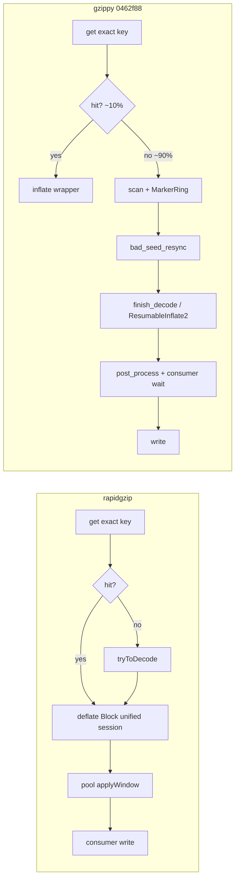

# Structural divergence: gzippy ↔ rapidgzip (decode path)

**Purpose:** Record runtime-observable divergences between gzippy and rapidgzip — for structural comparison and exploration, not lever ranking.

**Sources:**
- Fulcrum run `0462f88`, silesia-large, neurotic guest 199 (`/tmp/gzippy-locked-fulcrum-20260605-200740/`)
- Forensic code audit (vendor `GzipChunk.hpp`, `deflate.hpp`, `BlockFetcher.hpp`, `FasterVector.hpp`; gzippy parallel SM modules)

**Headline:** Recent convergence is real and mostly faithful — dispatch, window map, output path (writev + vmsplice/SpliceVault), thread priorities, segmented buffers, and rpmalloc per-`Vec` with lazy per-thread init all match vendor. Two prior audit flags (C1, D3) are **stale** (dead code, not production path). Genuine remaining divergences are fewer than earlier audits implied.

---

## Fulcrum behavioral snapshot (`0462f88`, T8 trace)

| Metric | gzippy | rapidgzip |
|--------|--------|-----------|
| T16 wall (interleaved min) | 0.986s | 0.475s |
| T8 trace wall | 820ms | 473ms |
| Decode decisions | 41 (4 clean, 37 window-absent) | — |
| Runtime window-absent | 90.2% (vs 31% static boundary fraction) | — |
| KEY-MISMATCH | 36/37 window-absent | — |

**Path mix (gzippy verbose):** `flip_to_clean=29`, `bad_seed_resync=35`, `pred@seed=0`, `handoff_window_grows=0`.

**Span diff (busy, Σ threads):**

| Span | gzippy | rapidgzip | Notes |
|------|--------|-----------|-------|
| `worker.block_body` | 1982ms | 0ms | MarkerRing bootstrap; no vendor-equivalent span |
| `worker.isal_stream_inflate` | 2519ms | 1376ms | Both present; gzippy 1.83× busy |
| `worker.scan_run` | 4447ms | 3093ms | Same outer shape; gzippy +44% busy |
| `post_process.apply_window` | 0ms wc | 236ms busy | Topology: resolve on pool vs consumer wait |

**Publish-chain model:** gzippy `L_resolve` × N ≈ 814ms predicted vs 820ms observed (binds). rapidgzip model underpredicts (210ms pred vs 473ms obs) — different binding mechanism.

**Fulcrum `[5] REMEDIATION` is stale** — recommends removed handoff/pred paths. Use binary counters, not Fulcrum remediation text.

---

## Re-verification of four flagged forensic items

| ID | Claim | Verdict | Detail |
|----|-------|---------|--------|
| **D1** | Unaligned marker ring + LUTs | **CONFIRMED, real** | `isal_lut_bulk.rs:700` `ring: Box<[u16; RING_SIZE]>` via `vec![0u16; RING_SIZE].into_boxed_slice()` → align 2. Vendor `deflate.hpp:926` `alignas(64) PreDecodedBuffer m_window16`; LUT backings `alignas(64)` at `:958-960`. In-code “Rust cannot alignas(64) on stable” comment is **false**. |
| **C1** | Missing dist==1 RLE in bulk-LUT copies | **STALE** | `copy_match` (:415) and `copy_match_u8` (:1093) off production path. Production flip returns `FlipToClean` → `finish_decode_chunk_with_inexact_offset` (`gzip_chunk.rs:686-703`), not `read_compressed_clean_u8`. Clean path uses `copy_match_fast` (`consume_first_decode.rs:504`) with dist==1 SIMD arm. Runtime impact ≈ 0. |
| **D2** | Manual pool over rpmalloc | **CONFIRMED, real** | `chunk_buffer_pool.rs` per-worker `Mutex<Vec<U8/U16>>` LIFO, cap 12. Vendor `FasterVector.hpp:120-128` — rpmalloc thread cache only, no manual pool. |
| **D3** | System-`Vec` marker scratch | **STALE** | `take_std_u16` (`chunk_buffer_pool.rs:308`) has **no production callers**. `data_with_markers` is `SegmentedU16` → `take_marker_segment()` → rpmalloc `U16`. Dead code to delete, not a live deviation. |

---

## (A) Not implemented — faithful vendor items

| # | Item | gzippy ↔ vendor | Runtime-observable? | Notes |
|---|------|-----------------|----------------------|-------|
| **A1** | 64-byte alignment of marker ring + LUTs (D1) | `isal_lut_bulk.rs:700,728` ↔ `deflate.hpp:926,958-960` | Yes — cache-line splits on 32-byte SIMD drain/copy | Vendor-mandated. Fix: `#[repr(align(64))]` newtype on ring + `DecoderScratch` / LUT backings. |
| **A2** | Window sparsity (`getUsedWindowSymbols`) | Absent (doc comment only) ↔ `GzipChunk.hpp:60-133` | Yes — larger `WindowMap` entries; extra compress CPU | Secondary. Port `determineUsedWindowSymbolsForLastSubchunk` + subchunk zeroing at `GzipChunk.hpp:93-96`. |
| **A3** | dist==1 memset in bulk-LUT (C1) | `isal_lut_bulk.rs:1093,415` ↔ `deflate.hpp:1393-1398` | No — off production path | Inert unless bulk-LUT clean tail promoted over ResumableInflate2. Do not prioritize. |
| **A4** | Multi-stream loop inside window-absent chunk | Single-member only ↔ `GzipChunk.hpp:468-654` `isAtStreamEnd` | Only if chunk spans gzip member boundary | Out of scope for routed single-member path. |

---

## (B) Implemented but divergent — runtime-observable

| # | Deviation | gzippy ↔ vendor | What profiler sees | Verdict |
|---|-----------|-----------------|-------------------|---------|
| **B1** | Worker count clamped to **physical** cores | `chunk_fetcher.rs:304,462` `.min(get_physical())` ↔ `BlockFetcher.hpp:179` logical `availableCores()` | On SMT host at high T: ≤ physical threads vs vendor ≈2× logical | **Divergent.** Vendor never clamps requested parallelization down. |
| **B2** | Manual `Mutex` buffer pool over rpmalloc (D2) | `chunk_buffer_pool.rs:215-292` ↔ `FasterVector.hpp:120-128` rpmalloc only | Extra mutex per take/Drop; cross-thread cache-line bounce; cap-12 reuse cliff | **Divergent.** Only structural allocator mismatch in page-fault dimension profiles flag. |
| **B3** | Flip to clean **earlier** than vendor | `gzip_chunk.rs:957` `!contains_marker_bytes()` ↔ `GzipChunk.hpp:520-525` `cleanDataCount >= MAX_WINDOW_SIZE` after Block flip | Fewer bytes through marker engine, more through ISA-L/ResumableInflate2 | **Favorable — KEEP.** Correct and faster; do not converge to vendor here. |
| **B4** | Dead allocator / clean-tail helpers | `take_std_u16`, `read_compressed_clean_u8`, `copy_match_u8` | None at runtime | Dead code — delete to prevent stale-audit confusion (C1/D3). |

### B1 — exact change (faithful)

```rust
// chunk_fetcher.rs:304 and :462
- let pool_size = parallelization.max(1).min(num_cpus::get_physical().max(1));
+ let pool_size = parallelization.max(1); // vendor BlockFetcher.hpp:179
```

### B2 — exact change (faithful, needs causal A/B)

Remove `take_u8` / `return_u8_to_worker` / `take_u16` mutex pools; `ChunkData::new_with_buffers` / `Drop` allocate and free `U8`/`U16` directly through `RpmallocAlloc`. Re-measure page faults (`asm_exc_page_fault` / `clear_page_erms` gap). Keep one-binary A/B — prewarm history makes this region treacherous.

### A1 — exact change (faithful)

```rust
#[repr(align(64))]
struct RingBuf([u16; RING_SIZE]);
// MarkerRing.ring: Box<RingBuf>
// Same on DecoderScratch / IsalLitLenCodePure / IsalDistCodePure backings
```

---

## Confirmed faithful (audit checked)

| Subsystem | gzippy | vendor |
|-----------|--------|--------|
| Dispatch | `decode_chunk_until_exact` (`gzip_chunk.rs:271`) | `decodeChunk` (`GzipChunk.hpp:661`) — exact window → inflate wrapper; inexact window → inflate from seed; absent → marker → flip |
| WindowMap | `BTreeMap` + `Mutex`, no Condvar, consumer-only publish | `WindowMap.hpp` |
| Output | writev + vmsplice / SpliceVault | vendor I/O path |
| Cache / prefetch | `max(16, P)`, `2*P` | `BlockFetcher.hpp:181-182` |
| Thread pool spawn | `P==1 ? 0 : P` | `:185` |
| Queue priorities | 0 decode / −1 post-process | vendor bands |
| Buffers | `SegmentedU8` / `SegmentedU16` 128 KiB segments | `DecodedData` / `FasterVector` |
| rpmalloc | Lazy per-thread init on workers | per-`Vec` `RpmallocAllocator` |

---

## Synthesis: three behavioral divergences (Fulcrum + code)



1. **Bootstrap engine** — MarkerRing + resync vs inline `deflate::Block`; signature `block_body` 1982ms vs 0ms.
2. **Path mix** — 90% window-absent / 97% KEY-MISMATCH; need rapidgzip path-mix counters to compare duty cycle under shared keying.
3. **Consumer ↔ resolve coupling** — publish-chain binds gzippy wall; rapidgzip does not bind the same way.

**Structural divergences independent of path mix:** B1 thread count, B2 buffer pool, A1 ring alignment. B3 early flip is favorable, not a gap.

---

## Exploration questions (numbers → code)

| Question | Method |
|----------|--------|
| rapidgzip path mix on same file? | Trace patch: `initialWindow` set vs null per `decodeChunk` |
| `bad_seed_resync` ↔ tryToDecode failures? | Correlate `SPEC_FAIL_*` per candidate bit |
| Bit cursor at flip vs vendor? | Oracle chunk: `tell()` at flip and ISA-L entry |
| B2 page-fault hypothesis? | Delete pool, causal perturbation on `asm_exc_page_fault` |
| B1 thread-count effect? | `pool_size` physical vs logical on SMT box, wall only |
| 4 clean chunks: which dispatch arm? | Assert `decode_chunk_with_inflate_wrapper` vs unified marker |

---

## Ranked remaining items (forensic, not perf levers)

For **vendor structural convergence** experiments:

1. **B2** — manual Mutex pool over rpmalloc (allocator-structure; page-fault dimension)
2. **B1** — physical-core clamp (thread-count observable on SMT)
3. **A1** — 64-byte ring + LUT alignment (vendor-mandated, cheap)

**Do not prioritize:** A3 (C1 stale), D3 cleanup-only, B3 “fix” toward vendor.

**Delete when convenient:** B4 dead helpers (`take_std_u16`, unused MarkerRing clean-u8 path).
