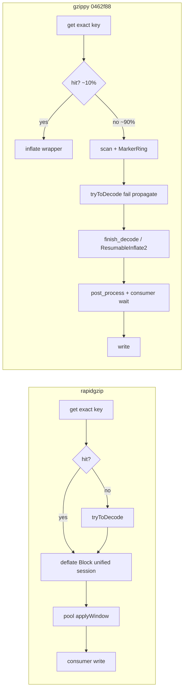

# Structural divergence: gzippy ↔ rapidgzip (decode path)

**Purpose:** Record runtime-observable divergences between gzippy and rapidgzip — for **exact structural convergence** to vendor (`file:line`), not lever ranking.

**Method:** Fulcrum numbers **guide** which divergences still show up at runtime (path-mix, span shape, publish-chain binding). They do **not** define done. A correct vendor-faithful change is **kept** on a TIE; a LOSS on wall with closed structure is progress. Done = gzippy's pipeline **matches** rapidgzip's structure and wall reaches parity on locked bench — not “we stopped when a number stopped moving.”

**Sources:**
- Fulcrum run `0462f88`, silesia-large, neurotic guest 199 (`/tmp/gzippy-locked-fulcrum-20260605-200740/`)
- Forensic code audit (vendor `GzipChunk.hpp`, `deflate.hpp`, `BlockFetcher.hpp`, `FasterVector.hpp`; gzippy parallel SM modules)

**Headline:** Recent convergence is real and mostly faithful — dispatch, window map, output path (writev + vmsplice/SpliceVault), thread priorities, segmented buffers, and rpmalloc per-`Vec` with lazy per-thread init all match vendor. Two prior audit flags (C1, D3) are **stale** (dead code, not production path). Genuine remaining divergences are fewer than earlier audits implied.

**Landed since `0462f88`:** Gate 1, A1, B1, B2, B4, Gate 0 bench hook (`0db757f`), `resumable_resync` deleted (`f8490b3`), Gate 4 harvest (`47a2c63`), structural slice (uncommitted): instrumentation (`worker.decode` per-attempt), consumer lifecycle (`consumer.window_publish`, `hasBeenPostProcessed` cache promote + harvest, `PREFETCH_*` counters), bootstrap default `marker_inflate::Block` (vendor `deflate::Block`; `GZIPPY_MARKER_RING=1` for LUT A/B).

---

## Fulcrum behavioral snapshot (`738dea6`, `/tmp/gzippy-locked-fulcrum-20260605-203323/`)

| Metric | gzippy | rapidgzip | Δ vs `0462f88` gzippy |
|--------|--------|-----------|------------------------|
| T16 wall (interleaved min) | 0.9460s | 0.4743s | −4.1% wall (532 vs 511 MB/s) |
| T8 trace wall | 807ms | 452ms | −1.6% trace wall |
| Decode decisions | 41 (4 clean, 37 window-absent) | — | unchanged |
| Runtime window-absent | 90.2% | — | unchanged |
| KEY-MISMATCH | 36/37 | — | unchanged |
| `bad_seed_resync` | **0** | — | Gate 1 verified |
| `worker.block_body` busy | 1960ms | 0ms | −1% (A1 noise) |
| Publish-chain model | binds (802ms pred) | slack (207ms pred vs 452ms obs) | RG `worker.decode` spans=0 — **patch not in binary @738dea6** |

**Path mix (gzippy verbose):** `flip_to_clean=29`, `bad_seed_resync=0`, `pred@seed=0`, `handoff_window_grows=0`.

**Path-mix (`bb36ef7`, T8):** rapidgzip `worker.decode` 97.4% window_absent (38/39); gzippy causal unchanged. `L_resolve` 18.8ms vs 10.3ms; publish-chain binds both.

**Gate 4 signal (T8):** `consumer.dispatch_recv` ~279ms wall-crit; rapidgzip resolve off consumer wall-crit when eager-complete.

**A1/B1/B2:** No measurable wall win at T16 (within 2.4% sd); bootstrap + KEY-MISMATCH dominate.

---

## Fulcrum behavioral snapshot (`0462f88`, T8 trace) — baseline

| Metric | gzippy | rapidgzip |
|--------|--------|-----------|
| T16 wall (interleaved min) | 0.986s | 0.475s |
| T8 trace wall | 820ms | 473ms |
| Decode decisions | 41 (4 clean, 37 window-absent) | — |
| Runtime window-absent | 90.2% (vs 31% static boundary fraction) | — |
| KEY-MISMATCH | 36/37 window-absent | — |

**Path mix (gzippy verbose):** `flip_to_clean=29`, `bad_seed_resync=35`, `pred@seed=0`, `handoff_window_grows=0`.

**Span diff (busy, Σ threads):**

| Span | gzippy | rapidgzip | Notes |
|------|--------|-----------|-------|
| `worker.block_body` | 1982ms | 0ms | MarkerRing bootstrap; no vendor-equivalent span |
| `worker.isal_stream_inflate` | 2519ms | 1376ms | Both present; gzippy 1.83× busy |
| `worker.scan_run` | 4447ms | 3093ms | Same outer shape; gzippy +44% busy |
| `post_process.apply_window` | 0ms wc | 236ms busy | Topology: resolve on pool vs consumer wait |

**Publish-chain model:** gzippy `L_resolve` × N ≈ 814ms predicted vs 820ms observed (binds). rapidgzip model underpredicts (210ms pred vs 473ms obs) — different binding mechanism.

**Fulcrum `[5] REMEDIATION` is stale** — recommends removed handoff/pred paths. Use binary counters, not Fulcrum remediation text.

---

## Re-verification of four flagged forensic items

| ID | Claim | Verdict | Detail |
|----|-------|---------|--------|
| **D1** | Unaligned marker ring + LUTs | **FIXED (`fc3d61e`)** | `AlignedMarkerRing` / `AlignedDecoderScratch` `#[repr(C, align(64))]`. Re-verify on Fulcrum. |
| **C1** | Missing dist==1 RLE in bulk-LUT copies | **STALE** | `copy_match` (:415) and `copy_match_u8` (:1093) off production path. Production flip returns `FlipToClean` → `finish_decode_chunk_with_inexact_offset` (`gzip_chunk.rs:686-703`), not `read_compressed_clean_u8`. Clean path uses `copy_match_fast` (`consume_first_decode.rs:504`) with dist==1 SIMD arm. Runtime impact ≈ 0. |
| **D2** | Manual pool over rpmalloc | **FIXED (`534415c`)** | Default: rpmalloc alloc per take; `GZIPPY_MANUAL_BUFFER_POOL=1` for A/B. Re-verify page faults on Fulcrum. |
| **D3** | System-`Vec` marker scratch | **FIXED (`738dea6`)** | `take_std_u16` deleted. |

---

## (A) Not implemented — faithful vendor items

| # | Item | gzippy ↔ vendor | Runtime-observable? | Notes |
|---|------|-----------------|----------------------|-------|
| **A1** | 64-byte alignment of marker ring + LUTs (D1) | **LANDED `fc3d61e`** ↔ `deflate.hpp:926,958-960` | Awaiting Fulcrum | — |
| **A2** | Window sparsity (`getUsedWindowSymbols`) | Absent (doc comment only) ↔ `GzipChunk.hpp:60-133` | Yes — larger `WindowMap` entries; extra compress CPU | Secondary. Port `determineUsedWindowSymbolsForLastSubchunk` + subchunk zeroing at `GzipChunk.hpp:93-96`. |
| **A3** | dist==1 memset in bulk-LUT (C1) | `isal_lut_bulk.rs:1093,415` ↔ `deflate.hpp:1393-1398` | No — off production path | Inert unless bulk-LUT clean tail promoted over ResumableInflate2. Do not prioritize. |
| **A4** | Multi-stream loop inside window-absent chunk | Single-member only ↔ `GzipChunk.hpp:468-654` `isAtStreamEnd` | Only if chunk spans gzip member boundary | Out of scope for routed single-member path. |

---

## (B) Implemented but divergent — runtime-observable

| # | Deviation | gzippy ↔ vendor | What profiler sees | Verdict |
|---|-----------|-----------------|-------------------|---------|
| **B1** | Worker count clamped to **physical** cores | **LANDED `ff00aa0`** ↔ `BlockFetcher.hpp:179` | Awaiting Fulcrum wall at T16 | Was divergent; fix applied. |
| **B2** | Manual `Mutex` buffer pool over rpmalloc (D2) | **LANDED `534415c`** ↔ `FasterVector.hpp:120-128` rpmalloc only | Awaiting Fulcrum page-fault / wall | Env-gated legacy pool for A/B. |
| **B3** | Flip to clean **earlier** than vendor | `gzip_chunk.rs:957` `!contains_marker_bytes()` ↔ `GzipChunk.hpp:520-525` `cleanDataCount >= MAX_WINDOW_SIZE` after Block flip | Fewer bytes through marker engine, more through ISA-L/ResumableInflate2 | **Favorable — KEEP.** Correct and faster; do not converge to vendor here. |
| **B4** | Dead allocator / clean-tail helpers | `take_std_u16` **deleted**; `read_compressed_clean_u8` / `copy_match_u8` remain inert in `isal_lut_bulk` | None at runtime | Partial cleanup done. |

### B1 — exact change (faithful)

```rust
// chunk_fetcher.rs:304 and :462
- let pool_size = parallelization.max(1).min(num_cpus::get_physical().max(1));
+ let pool_size = parallelization.max(1); // vendor BlockFetcher.hpp:179
```

### B2 — exact change (faithful, needs causal A/B)

Remove `take_u8` / `return_u8_to_worker` / `take_u16` mutex pools; `ChunkData::new_with_buffers` / `Drop` allocate and free `U8`/`U16` directly through `RpmallocAlloc`. Re-measure page faults (`asm_exc_page_fault` / `clear_page_erms` gap). Keep one-binary A/B — prewarm history makes this region treacherous.

### A1 — exact change (faithful)

```rust
#[repr(align(64))]
struct RingBuf([u16; RING_SIZE]);
// MarkerRing.ring: Box<RingBuf>
// Same on DecoderScratch / IsalLitLenCodePure / IsalDistCodePure backings
```

---

## Confirmed faithful (audit checked)

| Subsystem | gzippy | vendor |
|-----------|--------|--------|
| Dispatch | `decode_chunk_until_exact` (`gzip_chunk.rs:271`) | `decodeChunk` (`GzipChunk.hpp:661`) — exact window → inflate wrapper; inexact window → inflate from seed; absent → marker → flip |
| WindowMap | `BTreeMap` + `Mutex`, no Condvar, consumer-only publish | `WindowMap.hpp` |
| Output | writev + vmsplice / SpliceVault | vendor I/O path |
| Cache / prefetch | `max(16, P)`, `2*P` | `BlockFetcher.hpp:181-182` |
| Thread pool spawn | `P==1 ? 0 : P` | `:185` |
| Queue priorities | 0 decode / −1 post-process | vendor bands |
| Buffers | `SegmentedU8` / `SegmentedU16` 128 KiB segments | `DecodedData` / `FasterVector` |
| rpmalloc | Lazy per-thread init on workers | per-`Vec` `RpmallocAllocator` |

---

## Synthesis: three behavioral divergences (Fulcrum + code)



1. **Bootstrap engine** — MarkerRing + resync vs inline `deflate::Block`; signature `block_body` 1982ms vs 0ms.
2. **Path mix** — **both tools ~97% window-absent at partition seed** (`bb36ef7` Fulcrum: gzippy causal 90% / RG `worker.decode` 97.4%). KEY-MISMATCH is shared keying, not gzippy-only. Gap is bootstrap cost (MarkerRing `block_body` 1960ms vs RG 0) and slower `d_w`/`L_resolve`, not higher window-absent rate.
3. **Consumer ↔ resolve coupling** — publish-chain binds gzippy wall; rapidgzip does not bind the same way.

**Structural divergences independent of path mix (pre-Fulcrum):** B1/B2/A1 landed; measure at `738dea6`. B3 early flip is favorable, not a gap.

---

## Exploration questions (numbers → code)

| Question | Method |
|----------|--------|
| rapidgzip path mix on same file? | Trace patch: `initialWindow` set vs null per `decodeChunk` |
| `bad_seed_resync` ↔ tryToDecode failures? | Correlate `SPEC_FAIL_*` per candidate bit |
| Bit cursor at flip vs vendor? | Oracle chunk: `tell()` at flip and ISA-L entry |
| B2 page-fault hypothesis? | Delete pool, causal perturbation on `asm_exc_page_fault` |
| B1 thread-count effect? | `pool_size` physical vs logical on SMT box, wall only |
| 4 clean chunks: which dispatch arm? | Assert `decode_chunk_with_inflate_wrapper` vs unified marker |

---

## Ranked remaining structural ports (numbers show where behavior still diverges)

| Priority | Structural gap | Vendor anchor | What numbers still show |
|----------|------------------|---------------|-------------------------|
| 1 | **Bootstrap session** — finish path tuning after `Block` restore | `deflate.hpp` / `GzipChunk.hpp:661` | **Default engine now vendor `Block`** (was `MarkerRing`). Fulcrum: `worker.block_body` span may still show busy (gzippy-only span); measure wall + path-mix. `GZIPPY_MARKER_RING=1` keeps LUT ring for A/B. |
| 2 | **Consumer publish / resolve** — `L_resolve` + write-as-ready ordering | `GzipChunkFetcher.hpp:478-583` | **LANDED (uncommitted):** unified `consumer.window_publish`; pool + harvest `replace_prefetch_if_present`; `EagerSubmitted` carries `cache_key`; `hasBeenPostProcessed` take path. Remaining: lone-Ready drain policy (correctness-gated). Await Fulcrum `dispatch_recv` / `L_resolve`. |
| 3 | **`worker.decode` instrumentation** | `GzipChunkFetcher.hpp:712` | **LANDED (uncommitted):** per-attempt `window_absent` in `try_speculative_decode_candidate`; clean-only spans in `run_decode_task`. Re-run Fulcrum path-mix. |
| 4 | **A2** window sparsity | `GzipChunk.hpp:60-133` | secondary until 1–2 close |

**Landed (structural, numbers confirm closed or slack):** Gate 1 tryToDecode propagate, A1 align, B1 pool_size, B2 rpmalloc, B4 dead pool, Gate 0 path-mix patches, Gate 4 harvest + widen predecessor lookup (`47a2c63`).

**Gate 4 numbers (`47a2c63`, N=9 trustworthy):** Wall TIE vs pre-port; structure now includes vendor harvest (`:497-511`) and `get_predecessor` resolve-ahead. Numbers: `dispatch_recv` −30ms wall-crit; `L_resolve` still 2× RG — **remaining gap is serial publish work per link**, not “abandon Gate 4.” **Consumer lifecycle slice (uncommitted):** unified `consumer.window_publish` span; pool `replace_prefetch_if_present` on post-process complete (`PREFETCH_POST_PROCESS_PROMOTED`); `into_chunk_data` short-circuit when `arc.markers_resolved`. Next Fulcrum: `worker.decode` WA% vs causal; `dispatch_recv` / `L_resolve` vs Gate 4 baseline.

**Gate 4 (detail):** Vendor `waitForReplacedMarkers` (`GzipChunkFetcher.hpp:478-518`) blocks on the *current* chunk's `applyWindow` future but **non-blocking harvests** other ready futures from `m_markersBeingReplaced` and runs `queuePrefetchedChunkPostProcessing` during the wait. gzippy now mirrors harvest + in-cache promote on pool complete. Remaining structural delta: FIFO `pending` write order vs vendor write-as-ready ordering.

**Do not prioritize:** A3 (C1 stale), B3 “fix” toward vendor. Fulcrum `[5] REMEDIATION` handoff/pred paths — **stale**, do not re-wire.
